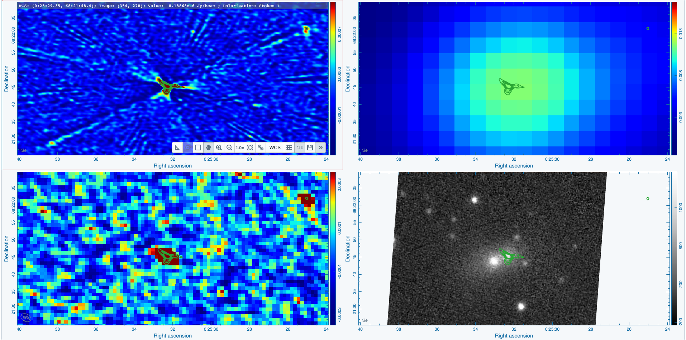
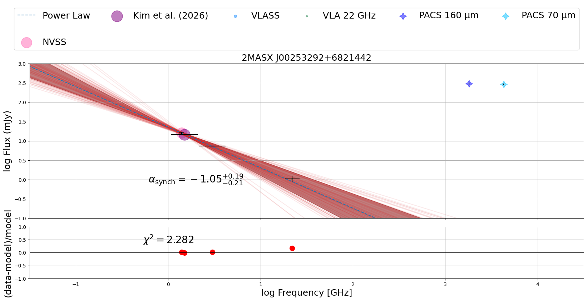
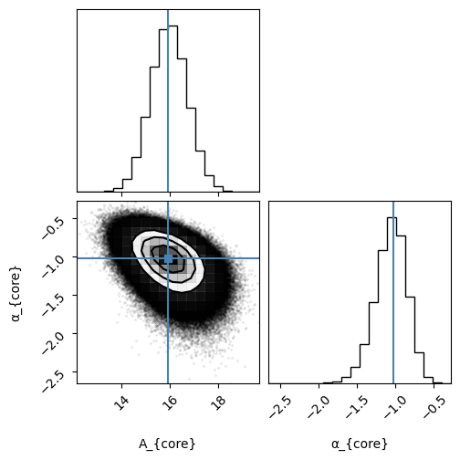

### Preview of 2MASX J00253292+6821442 is shown below. The contours represent the 22 GHz 1" image. 

### Below is the full radio SED for 2MASX J00253292+6821442. 

### The corner plot for the derived SED is shown below.

