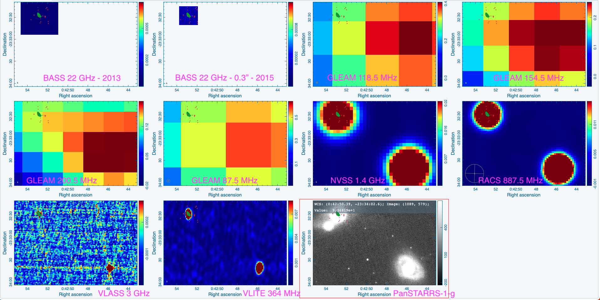

Preview of NGC 235A is shown below. The contours represent the 2013 - 22 GHz 1" image. The galaxy in the bottom right of the PanSTARRS-1-g image is NGC 232. We do detect this galaxy in our 3" and 6" images at 22 GHz. 

