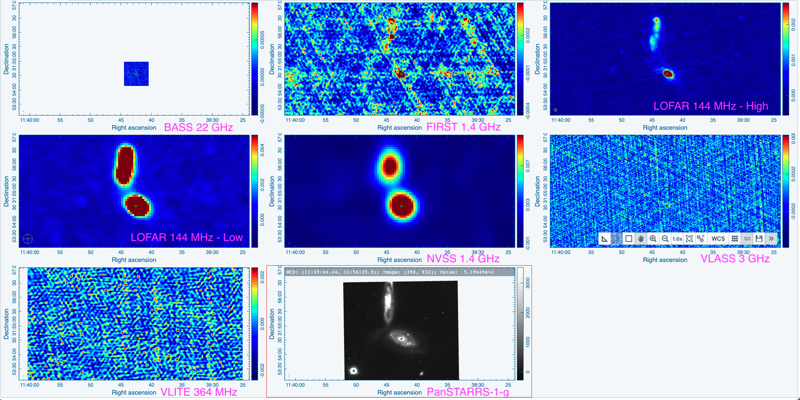

Preview of NGC 3786 is shown below. The contours represent the 22 GHz 1" image. The galaxy in the top half of the PanSTARRS-1-g image is not detected at 22 GHz, but is detected at other frequencies.

